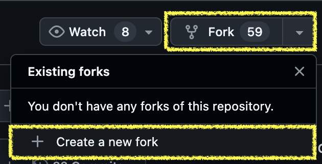
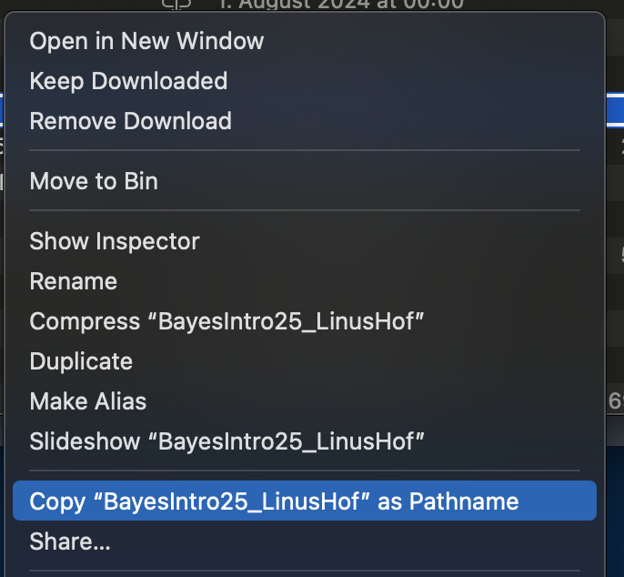
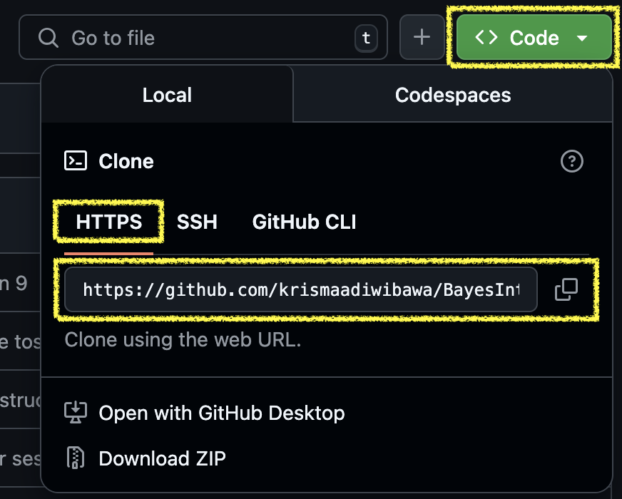

# How to Fork and Clone a GitHub Repository

## Forking

By creating a **fork** we are creating a copy of someone else’s
repository (repo) into our own GitHub account. We can work on the fork
(branching, merging, etc.) without affecting the source repo.

Only when we make a *pull request* can the owner of the source repo
integrate changes we made to our fork into his repo, usually after
reviewing and approving them.

A fork is *static*. It only mirrors the state of the source repo at the
time we create the fork.

## Cloning

**Cloning** is a process of creating a copy of the project’s code and
its complete version history from the remote repository on the local
machine.

We can clone both a fork or a source repo.

## Content and Goal

In this tutorial we are going to learn how to create a fork, clone a
fork, and how to ensure that our fork and local clone reflect the
current state of the source repo by synchronizing. We are going to
specify the source repo as **upstream** and our fork as **origin** of
our clone.

This tutorial uses MacOS as an example, but the commands are very
similar across operating systems. If you use Windows or Linux, you can
easily find the equivalents of the commands on the internet.

This tutorial assumes that you have:

- [x] installed [Git](https://git-scm.com/downloads)

- [x] created a [GitHub
  account](https://docs.github.com/en/get-started/start-your-journey/creating-an-account-on-github)

Let’s say we want to create a fork and of this repo:
<https://github.com/linushof/BayesIntro25> and clone it.

Cloning is handy because it creates a copy of eveything of that repo in
our local machine (laptop or PC) and browsing the material directly in
our local folder is easier.

That repo is where [Linus](https://github.com/linushof) stores the
materials (lecture slides, etc.) of his course *Introduction to Bayesian
Data Analysis (Summer 2025)*. I can attest the course is awesome! I took
it in 2024 😉

During the course, he may upload new lecture slides as the course
progresses. He may also make correction on these slides and change parts
of the content. So, it is important that our clone reflect the most
current state of that repo.

So, let’s get started.

 

## Step 1: Create a fork of BayesIntro25 repo

- Go to the repo.

- Click the button ‘Fork’ and ‘Create a new fork’.

  
  

- We can name the fork with any name as we want. It will not affect the
  source repo.

- Now we have a fork of the repo BayesIntro25 in our GitHub.

   

## Step 2: Create a copy of our fork as a local folder in our laptop

It is easier to interact with the files inside the fork through our
local machine. To do this we can create a local folder that contains
everything inside our fork.

- Create a folder in our laptop/PC wherever we want to store files of
  the fork.

- Copy the path to this folder. On Mac, right-click the folder and hold
  the `option` button. Then click the `Copy "(folder name)" as Pathname`

  

- Open `Terminal` and navigate to the folder by:
  `cd (path to the folder)`

- Once we navigated to the folder, clone our fork by:
  `git clone (the https: of our fork) .`

  The “.” means *copy everything inside the fork to this folder and do
  not create a subfolder*

  You can find the https of your fork by clicking the `Code` button in
  our fork page.

  

- Now, our fork is automatically set as the `origin` of our local
  folder. You can check this by using command `git remote -v` in
  Terminal. The output should show that your origin is the https of your
  fork.

 

## Step 3: Set the source repo as upstream of our folder

Now, we have set our fork as `origin` of our folder. But the fork is
static and will not update any changes made in the source repo. To
update our folder with the most recent changes in the source repo we
must set the source repo as `upstream`.

In Terminal use this command:

`git remote add upstream https://github.com/linushof/BayesIntro25.git`

This set the source repo as upstream to our clone folder.

To check if we have successfully set our fork as `origin` and our source
repo as `upstream`, again:   `git remote -v`

 

## Step 4: Update our local folder with the most recent changes of the source repo

Everytime we want to synchronize the folder with the source repo
(upstream),

- first check if we already navigated to the folder by using command:

  `pwd` - This command tells our position

- If our position is not in the folder, navigate to the folder by using
  command: `cd (path to folder)`

- Then, `git fetch upstream` to download any changes (commit, branches,
  tags, etc.) in the source repo. By fetching, we simple “copy” all
  changes in the upstream repo. It’s like copying a file and not yet
  pasting. What we copied is still in the clipboard, to be pasted
  somewhere later

- Then, `git checkout main` to navigate to our ‘main’ branch of our
  local folder

- If you are unsure if you have moved to the ‘main’ branch of your
  folder, use command: `git branch`. It is going to list all branches
  that exist in your local folder. The branch marked with asterisk (\*)
  is the active branch.

- Then, `git merge upstream/main` to merge all the commits that’s been
  done in the source repo (upstream) with our local folder’s ‘main’
  branch. Here you are basically making a commit to your clone and the
  ‘content’ of this commit is all the commits of the source repo.

  

   

## Step 5: Push our updated folder to our fork

- Now our local folder reflects the most recent state of the source repo
  (upstream), but our fork doesn’t.

- To push our local folder’s state to our
  fork: `git push origin main`

- This basically pushes the commits in our local folder ‘main’ branch
  into the ‘main’ branch of our fork (here specified as origin).

   

## Now our local folder and fork is up-to-date!
